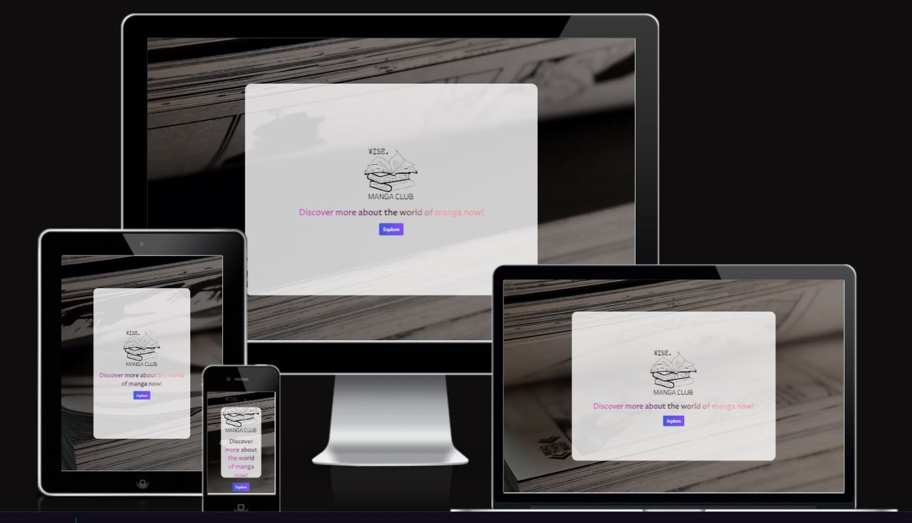
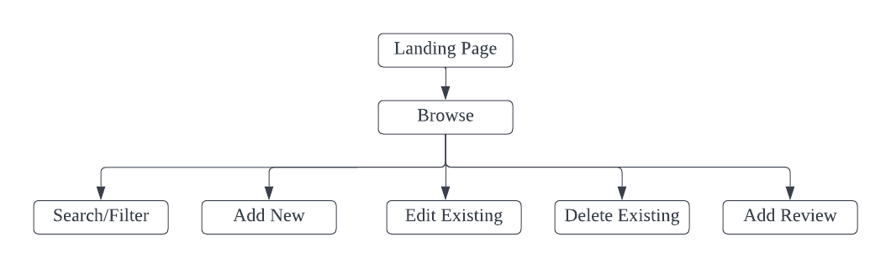

# Project-2-Wise Manga Club

Live demo can be accessed [here](https://wisemangaclub.netlify.app/).

## Project Overview 

**Context and Value Proposition**
With over thousands of manga titles available to read, it can be tough for people who want to find the next title to read. Wise Manga Club is a centralized platform where users can filter through the many titles and find one which is suitable for them. 

Users can also add a manga on the website for others to view and help authors publicise their hard work. 

**Target Audience**
Mainly targetting adolescence to young adults (10-29 years old) who are the bulk of manga readers. 

**Organisation Goals** 

For manga enthusiast like myself, I often find myself spending time on forums to find the next manga title to read or to listen to other's opinions of the manga. A centralised website like Wise Manga Club provides convenient features without navigating through the different forums available online.        

**User Goals**
1. Find out more about a manga that they are currently reading 
2. Search for a manga of their interest 
3. Add a new manga not available on the website 
4. Update information 

## UI/UX 

**1. Strategy**

**User** 

- Demographic: New or long-time manga readers 

- Needs: Finding the next title to read 

- Pain points: User has to navigate through different forums available online to find out more information of a manga or participate in the individual manga's discussions. 

| User Stories | Acceptance Criteria(s) |
| ------------ | ---------------------- |
| As a reader who wants to find a title that has been completed, I want to know what are the available options that I have | Search/Filter function to allow user to filter based on his/her criteria | 
| As a manga enthusiast, I want to promote a manga that is recently released or update information about a particular manga | Add, Update, Delete function available for user to utilize |  

**2. Scope** 

**Functional**

- Browse all the available manga titles 
- Search/Filter through manga based on title, author, genre etc 
- Create a new manga title
- Update information of a manga title
- Leave review for a current manga listing
- Delete/Remove a manga listing 

**Non-Functional** 

- Application is mobile responsive, with small screen having a navigation bar to avoid clutteredness on the screen 

**3. Structure** 

 

**4. Surface**

**Fonts** 
Proza Libre is used as the font for the description on the landing page and the review page title because of it's professional outlook. 

**Icons** 

- Fontawesome icons: placed beside review, edit and delete button to better illustrate the buttons 

## Technologies Used 

| Technology | Usage |
| -- | -- |
| HTML, CSS, Bootstrap 5, React Bootstrap | Structure, styling and interactivity of website |
| React | Frontend framework | 
| Axios | HTTP client to Express server endpoints | 
| Express | Build restful API | 
| MongoDB | Document-oriented database, where the all the data is stored |

## Testing 

Test Cases can be found [here](./project-02/readme/Test-Cases.pdf)

## Deployment 

**Frontend Deployment**
The React app is hosted using [Netlify](https://www.netlify.com/).

Prerequisites:
- Any edits were added, commited, and pushed to Github repository
- Netlify is connected and authorized to Github account
- Netlify is connected to GitHub repository via "New site from Git"
- "GitHub"  has been selected for continuous deployment

Steps to publish:
1. After connecting to repository, ensure edits were added, commited, and pushed to Github repository
2. Netlify will start to build and perform automatic deployments upon detecting changes

**Backend Deployment**

1. Sign up for an account at Netlify
    - Go to https://www.netlify.com/ and log in with your Github account. 
2. Commit and push your code to Github
    - Commit and push your latest code.
3. Create a new site from Git
    - Click on "New site from Git"
4. Choose Continuous Deployment
5. Select or search for your repo 
    - Select the repo to deploy and select the Deploy Site button.
6. Wait for deployment to be done

## Challenges and Future Implementations 

1.  

## Credits 

**Fonts, Icons and Images** 

- [Google Font](https://fonts.google.com/specimen/Proza+Libre) - Landing page description, review page title
- [Font Awesome](https://fontawesome.com/) - Review/edit/delete icon 
- [Bootstrap 5](https://getbootstrap.com/) - Components and utilities
- [Unsplash](https://unsplash.com/) - Landing page backgroud image  
- [Coolors](https://coolors.co/820263-d90368-eadeda-2e294e-ffd400) - Choosing complementary colours
- [Pexels](https://www.pexels.com/search/videos/videos/) - Landing page background video

**Others** 
- [React-toastify](https://github.com/fkhadra/react-toastify) - Alerts after completing CRUD
- [React-circular-progressbar](https://www.npmjs.com/package/react-circular-progressbar) - Display overall review on review page
- [Multiselect-react-dropdown](https://www.npmjs.com/package/multiselect-react-dropdown) - Multiselect for genre under update manga
- [Bytes](https://ui.dev/amiresponsive) - Display mobile responsiveness
- [Lucidchart](https://www.lucidchart.com/pages/) - Design structure of page 
- [Axios](https://cdnjs.com/libraries/axios) - AJAX request
- [Netlify](https://www.netlify.com/) - Deployment 
